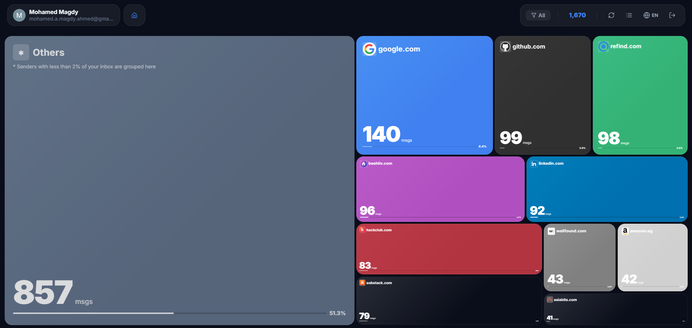

> **Under Development**
> This project is currently a work in progress. Features may change and there might be bugs!

Tree inboxy is a data visulization tool that helps you to visualize your gmail inbox as a simple Tree Map. It's helpful to identify which services send you the most emails or maybe an unblocked junk :)

Steps to get your Google API Client ID:
1. Go to the [Google API Console](https://console.developers.google.com/)
2. Create a new project or select an existing one
3. Enable the [Gmail API](https://console.cloud.google.com/apis/api/gmail.googleapis.com/)
4. Create a Web Client (OAuth Client) in the Clients section (At Credentials Tab)
5. Add (https://latebrix.github.io) as Authorized JavaScript origin.
6. Add (https://latebrix.github.io) and (https://latebrix.github.io/Tree-Inboxy/) as Authorized Redirect URI.
7. Save & Copy the OAuth client ID then paste it the Tree Inboxy Website
8. Add your Gmail email (which you will use in the website) in the Audience Tab (You'll find the Audience option inside the page of the created Web Client)
9. You're ready to use Tree Inboxy website!

NOTE: Your data doesn't leave your device, it's all stored locally in your browser. + You can also use Tree Inboxy on LocalHost (But don't forget to change JavaScript origin & Redirect URI)

---
*Created as a weekend project to play around with Data Visualization and Google APIs.... I promise I'll make a professional ReadME ASAP* *-- Mohamed on 27 Feb 2026: Done as promised!*

